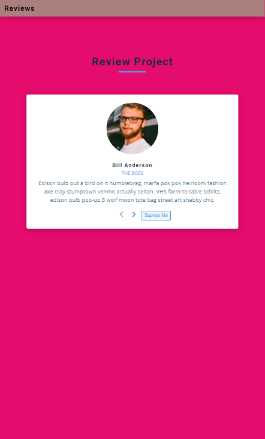

# Page_Review

This is a simple Vanilla JavaScript Project. Knowledge of DOM Manipulation and JavaScript methods were used to make a simple webpage change that increases the changes the value of counter whenevr a button is click. There is also a reset button to rest the button clicked.

- 
- 

## :red_circle: Live Demo

[Live Preview Link](https://gunjuzone.github.io/Page_Review/)

## :hammer: Built With

- HTML, CSS and JavaScript

To get a local copy up and running follow these simple steps:

1. Go to the [repository page](https://github.com/Gunjuzone/Page_Review/tree/development_branch).
2. git clone the repository using git command `git clone <link>`.
3. cd into the folder
4. git checkout branchName (mobile-version) using git command `git checkout <branchName>`.
5. Open home.html or about.html with live server

## :blue_book: Learning Objectives

- Use JavaScript to manipulate buttons to select a review of a product array make a web page change.
- Demonstrate ability to create UIs adaptable to different screen sizes using media queries.

- Apply best practices in HTML code.
- Use CSS selectors correctly.
- Use Flexbox to place elements in the page.
- Demonstrate ability to create UIs adaptable to different screen sizes using media queries.
- Use GitHub Pages to deploy web pages.
- Apply JavaScript best practices and language style guides in code.
- Use JavaScript to manipulate DOM elements.
- Use JavaScript events.

## Authors

👤 **Shakiru Olagunju**

- GitHub: [@Gunjuzone](https://github.com/Gunjuzone)

## 🤝 :raised_hand: :raised_hand: Contributions

Contributions, issues, and feature requests are welcome!

Feel free to check the [issues page](https://github.com/Gunjuzone/Page_Review/issues1).

## :grey_exclamation: Acknowledgments

- [John Smilga](https://www.johnsmilga.com/)

## 📝 License

This project is [MIT](LICENSE) licensed.
